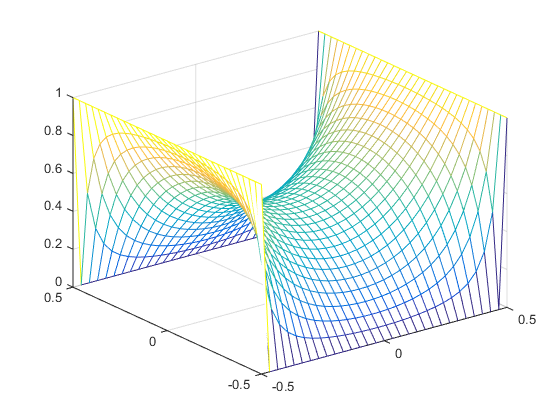

# hw_relaxation
Homework for Garcia ch 8, relaxation methods

  
*   [Problem 1 (in-class)](#2)
*   [Problem 2 (homework)](#3)

## Problem 1 (in-class)

Modify <tt>relaxation2d_exercise.m</tt> to solve Laplace's equation with the Jacobi, Gauss-Seidel, and SOR methods. Apply boundary conditions of:
 * Φ = 1 at *x* = ±0.5 (left/right column)
 * Φ = 0 at *y* = ±0.5 (top/bottom row)
 * Use an initial guess of 0 in the interior.

Your code is working if you observe this potential:

## Problem 2 (homework)

Modify <tt>relaxation2d_exercise.m</tt> to solve the following Poisson equation with the Jacobi, Gauss-Seidel, and SOR methods. 

∇2Φ = 10cos(*πx*)cos(3*πy*)

Use the following boundary conditions:
 * Φ = 1 for *x* = -0.5 (left boundary)
 * Φ = 0 for all other outside boundaries
 * Φ = 2 for an interior square boundary: -0.1 < *x* < 0.1, -0.1 < *y* < 0.1

Set your initial guess to 0 for all points not on a boundary and use ω = 1.6 for the SOR method. Animate your solutions using the mesh plots.
